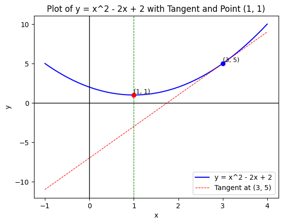
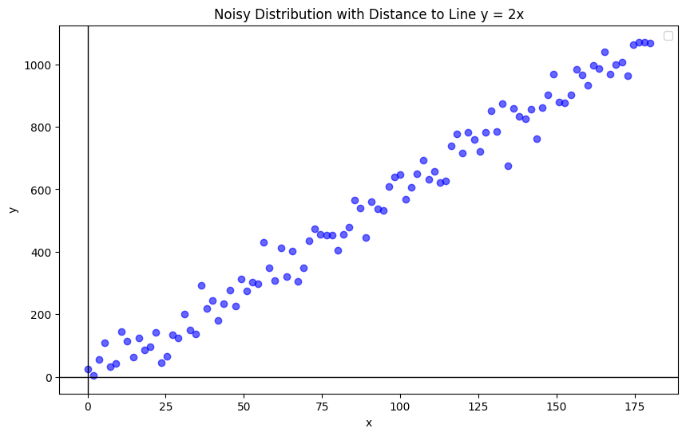
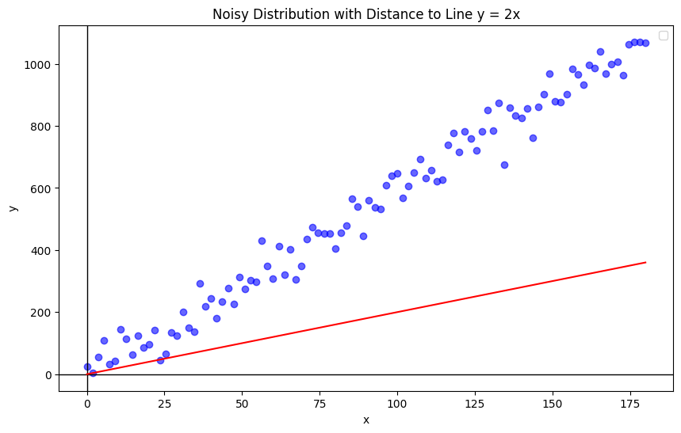
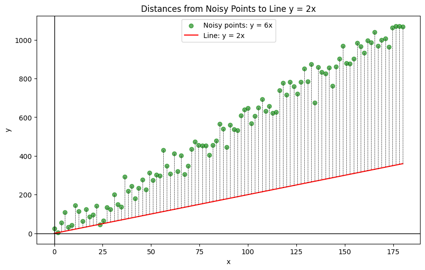
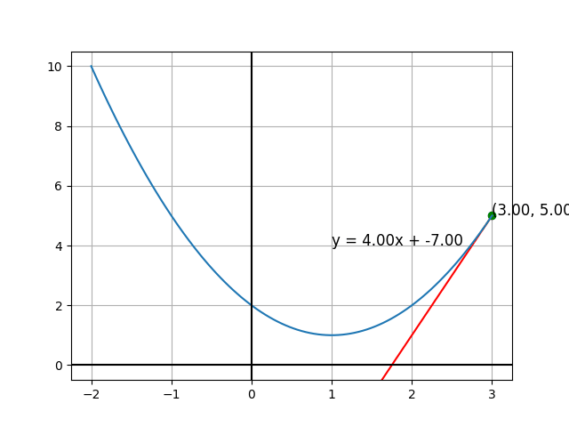
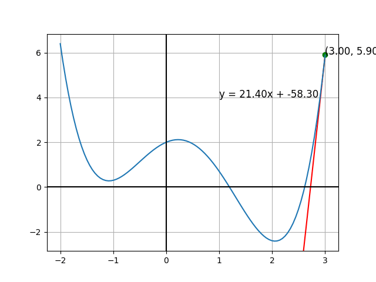
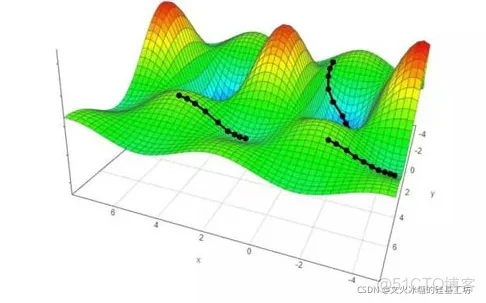
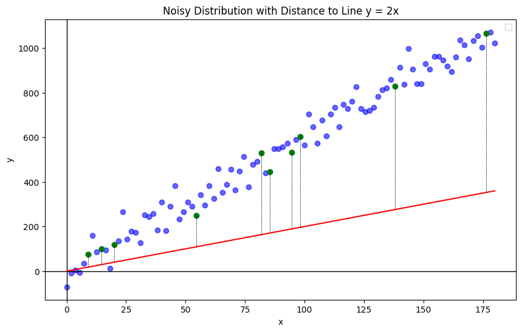

# 机器学习原理（一）

李捷
2025 年 8 月 4 日

## 一、什么是导数？

从我们熟悉的二次函数开始

$$
y = x^2 - 2x + 2
$$



---

如果 $x$ 变化了 $\Delta x$，则对应的 $y$ 变化量为 $\Delta y$

$$
\begin{align*}
y+\Delta y =& (x+\Delta x)^2 - 2 (x+\Delta x) + 2 \\
%   =& x^2 + 2x\Delta x + (\Delta x)^2 - 2x - 2\Delta x + 2 \\
%  =& (x^2 - 2x + 2) + 2x\Delta x - 2\Delta x + (\Delta x)^2 \\
%  =& y  +2x\Delta x - 2\Delta x+ (\Delta x)^2 \\
\end{align*}
$$

化简移项后得

$$
\Delta y = 2x\Delta x - 2\Delta x+ (\Delta x)^2
$$

同除 $\Delta x$ 得

$$
\begin{align*}
\frac{\Delta y}{\Delta x} =&
% \frac{
%    \left(y  +2x\Delta x - 2\Delta x+ (\Delta x)^2
%    \right) - y
% }{\Delta x} \\
% = &
% \frac{
%    2x\Delta x - 2\Delta x+ (\Delta x)^2
% }{\Delta x}
= 2x-2 + \Delta x
\end{align*}
$$

同时取极限

$$
\lim_{\Delta x \to 0} \frac {\Delta y }{\Delta x}
= \lim_{\Delta x \to 0} (2x -2 + \Delta x) \\
= 2x - 2
$$

---

刚刚的过程如果用数学语言描述，当 $y=f(x)$

则导数的极限表达式为

$$
f^\prime(x) = \lim_{\Delta x \to 0}
\frac{f(x+ \Delta x) - f(x)}{\Delta x}
$$

计算机是怎么计算导数的呢？

```py
# 定义函数
def f(x):
   return x**2 - 2*x + 2

# 定义导数
def df_dx(x):
   delta = 0.00001
   return (f(x + delta) - f(x)) / delta
```

## 二、什么是偏导数？

**导数**和**偏导数**的本质是一致的

区别

- 导数，指的是**一元函数**中，函数 $y=f(x)$ 在某一点处 $x$ 坐标轴正方向的变化率
- 偏导数，指的是**多元函数**中，函数 $y=f(x_1,x_2,\dots,x_n)$ 在某一点处沿某一坐标轴 $(x_1,x_2,…,x_n)$ 正方向的变化率

---

对于一个函数

$$
f(x, y, z) = x^2 + 3y - 4z
$$

求偏导数（即我们默认 $x, y, z$ 是独立的）

$$
\frac {\partial f}{\partial x}
= \frac{\partial }{\partial x}(x^2)
+ \frac{\partial }{\partial x}(3y)
+ \frac{\partial }{\partial x}(-4z)
= 2x
$$

---

$$
\frac{\partial f }{\partial x} \approx
\frac{f(x+\Delta x, y) -f(x, y) }{\Delta x}
$$

$$
\frac{\partial f }{\partial y} \approx
\frac{f(x, y + \Delta y) -f(x, y) }{\Delta y}
$$

计算机中也是很简单

```py
def pf_px(x, y):
   delta = 0.00001
   return (f(x + delta, y) - f(x, y)) / delta

def pf_py(x, y):
   delta = 0.00001
   return (f(x, y + delta) - f(x, y)) / delta
```

---

则我们定义梯度

$$
\nabla f =
      \left(
         \frac{\partial f }{\partial x} ,
         \frac{\partial f }{\partial y}
      \right)
$$

> 在计算机中其实就是一个**数组**

举例说明

$$
f(x, y) = (x^2 - 2x) + (y^2 + 4y) + 1
$$

那么

$$
\nabla f = \left(2x-2, 2y+4\right)
$$

如果求某点的梯度，则是

$$

\nabla f | _{x=2, y=1} = \left(2, 6\right)
$$

## 三、导数在线性回归的应用

我们找了一组互联宝地周围的二手房价格（2025.8.3）

| 名称     | 面积($m^2$) | 价格(万) |
| -------- | ----------- | -------- |
| 国富苑   | 146.87      | 718      |
| 凤城路   | 69.4        | 408      |
| 华升新苑 | 157.7       | 1350     |
| 长阳新苑 | 86.54       | 570      |
| 控江路   | 69.65       | 350      |
| 凤城路   | 99.25       | 480      |
| ...      | ...         | ...      |

---

查看数据分布



---

首先我们对其建模，称**为预测函数**

$$
y = wx
$$



---

现在我们选取任意一点 $(x_i, y_i)$，其与预测函数的差距为

$$
d_i = (y_i - wx_i)^2
$$


---

现在我们对所有点计算距离和 $D = \frac{1}{N} (d_1 + d_2 + \dots + d_n)$



---

$$
\begin{align*}
D =& \frac{1}{N} (d_1 + d_2 + \dots + d_n) \cr
=& \frac 1N [ (y_1 - wx_1)^2
+ (y_2 - wx_2)^2
+ \dots
+ (y_n - wx_n^2) ]\cr
=& \frac 1N  [
({x_1}^2  + \dots + {x_n}^2) w^2
+ (-2x_1y_1 \dots -2x_ny_n) w
+ ({y_1}^2 + \dots +y_n^2)
   ] \cr
=& Aw^2 + Bw + C
\end{align*}
$$

那么距离和 $D$ 我们又称为 $\text{Loss}(w)$ 称为**损失函数**

表示预测函数与真实模型的差距，所以我们希望 $\text{Loss}$ 越小越好

寻找这个最小 $\text{Loss}$ 的过程，我们叫作**梯度下降**

## 四、梯度下降

我们有了损失函数 $\text{Loss}$ 的表达式

$$
\text{Loss}(w) = Aw^2 + Bw + C
$$

想要求解最小的 $\text{Loss}(w)$ 当然可以使用 $w = -\frac {B}{2A}$，称为解析解，我们选择另一个更加通用的方法 **"梯度下降"**

---

| 梯度下降法                           |                        |
| ------------------------------------ | ---------------------- |
| 不断往导数的反方向走<br>直到导数为 0 |  |

---

| 梯度下降法           |                        |
| -------------------- | ---------------------- |
| 对于一般函数也是如此 |  |

---

我们刚刚的建模是一元函数 $\text{Loss}(w) = f(w)$

但是真实世界的损失函数可能是二维甚至是多维

$$
\begin{align*}
\text{Loss}(w_1, w_2) =& f(w_1, w_2) \\
\text{Loss}(w_1, w_2, \dots, w_n) =& f(w_1, w_2, \dots, w_n)
\end{align*}
$$



## 五、梯度下降算法

- 梯度下降算法
- 随机梯度下降算法
- 小批量随机梯度下降算法

---

梯度下降算法

$$
\text{Loss}(w_1, w_2, \dots, w_n) = \frac 1N \sum_i d(w_i)
$$


---

随机梯度下降算法

$$
\text{Loss}(w_1, w_2, \dots, w_n) = d(w_i)
$$


---

小批量随机梯度下降算法

$$
\text{Loss}(w_1, w_2, \dots, w_n) = \frac 1{M} \sum_{i} d(w_i)
$$


