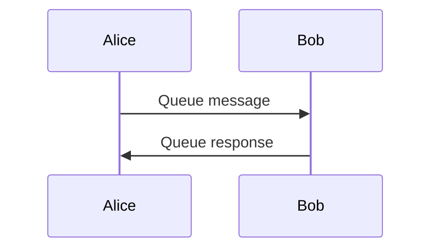
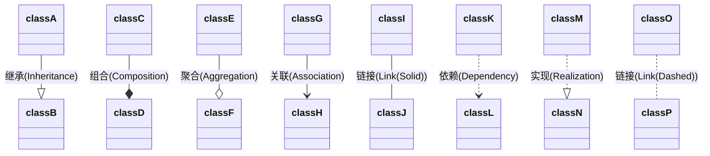

## 时序图

```mermaid
sequenceDiagram
    participant Alice
    participant Bob
    Alice->>Bob: Queue message
    Bob->>Alice: Queue response
```

```mermaid
classDiagram
classA --|> classB : 继承(Inheritance)
classC --* classD : 组合(Composition)
classE --o classF : 聚合(Aggregation)
classG --> classH : 关联(Association)
classI -- classJ : 链接(Link(Solid))
classK ..> classL : 依赖(Dependency)
classM ..|> classN : 实现(Realization)
classO .. classP : 链接(Link(Dashed))

```

## 参考资料

- [Mermaid 使用教程：从入门到精通 - 知乎](https://zhuanlan.zhihu.com/p/627356428)

## 参考资料
